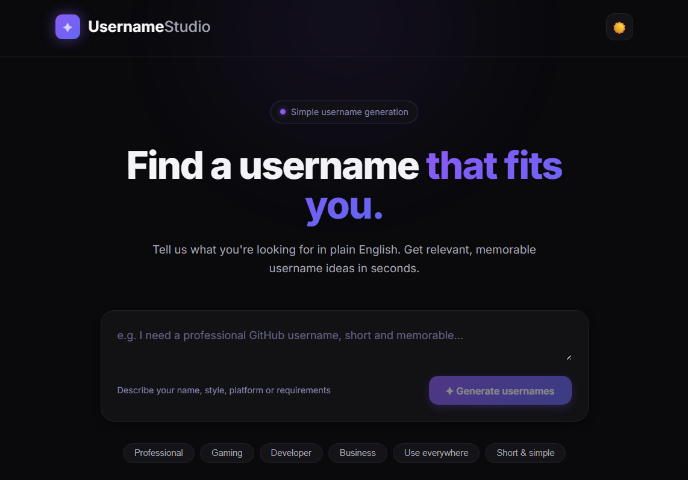

#  Username Generator

> A minimal, AI-powered username generator.

Describe what you want — get 20 relevant, memorable username ideas in seconds.

**Local-only tool.** Run `npm start` → open `http://localhost:3000`

---

## Quick Example

```
You: "Professional GitHub username containing Alex, no numbers"

Bot: alexdev, alexcoder, alexlabs, alexstudio, alexworks, alexhub,
     alexforge, alexcode, alextech, alexbuild, alexify, alexio,
     alexone, alexcore, alexpro, alexmate, alexview, alexspace,
     alexfield, alexpoint
```

---

## Features

| ✨ | Natural language input |
|---|---|
| Just type what you want — no dropdowns or complicated forms |

| 🎯 | Smart constraint handling |
|---|---|
| Respects "no numbers", specific words, style, length, and more |

| 📋 | One-click copy |
|---|---|
| Copy any suggestion instantly with visual "Copied" feedback |

| 🔁 | Generate again |
|---|---|
| Get a fresh batch with the same prompt — no need to retype |

| 🌙 | Dark-first design |
|---|---|
| Premium dark UI with optional light mode |

| 📱 | Fully responsive |
|---|---|
| Looks great on mobile, tablet, and desktop |

| 🔒 | Privacy-first |
|---|---|
| No accounts, no tracking, no history saved |

---

## Quick Start

```bash
git clone https://github.com/AbhinavOG/username-generator.git
cd username-generator
npm install
npm start
```

Open `http://localhost:3000` in your browser.

---

## How It Works

```
┌─────────┐    ┌───────────┐    ┌──────────┐    ┌────────┐
│  You    │───▶│  Browser  │───▶│  Express │───▶│  CCR   │
│         │    │           │    │  Server  │    │  Proxy │
└─────────┘    └───────────┘    └──────────┘    └────────┘
                  │                 │            │
                  │ Renders UI      │ Validates  │ AI
                  │ & manages state │ response   │
                  ▼                 ▼            ▼
              ┌──────────────────────────────────────┐
              │      20 Username Suggestions         │
              │    Copy • Generate Again • Regenerate│
              └──────────────────────────────────────┘
```

---

## Tech Stack

```
┌────────────┐     ┌────────────┐     ┌────────────┐
│   Vanilla   │────▶│  Node.js   │────▶│    CCR     │
│  HTML/CSS/JS│     │  Express   │     │  Gateway   │
└────────────┘     └────────────┘     └────────────┘
   (no build)       (tiny footprint)   (no keys hardcoded)
```

---

## Configuration

All credentials are loaded from your CCR environment at runtime — nothing hardcoded.

| Variable | Description | Default |
|----------|-------------|---------|
| `ANTHROPIC_BASE_URL` | CCR proxy URL | `http://127.0.0.1:3456` |
| `CCR_CORE_GATEWAY_AUTH_TOKEN` | Gateway token | *(from CCR)* |
| `CCR_REMOTE_SYNC_API_KEY_HELPER` | Key helper script | *(from CCR)* |
| `AI_MODEL` | AI model | `OpenRouter/cohere/north-mini-code:free` |
| `PORT` | Server port | `3000` |

---

## API Reference

```
POST /api/generate
Content-Type: application/json

{ "prompt": "Gaming username with Shadow" }
```

```json
{
  "usernames": [
    "ShadowBlade",
    "ShadowWolf",
    "ShadowStrike",
    "..."
  ]
}
```

---

## Screenshots


---

## License

MIT — use it, fork it, make it your own.
